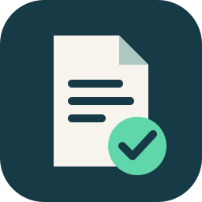
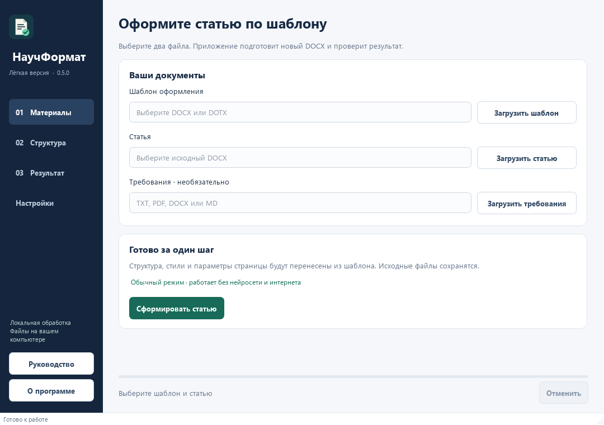

# НаучФормат 0.5.0

**Научная статья — в формате издателя.**

Приложение для Windows, которое переносит рукопись DOCX в оформление
издательского шаблона DOCX/DOTX. Обработка выполняется локально;
Python, Word и нейросеть для обычной работы не требуются.

[Скачать установщик](https://github.com/suhafriday-hub/NauchFormat-Releases/releases/latest)
· [Руководство](docs/USER_GUIDE.md)
· [История версий](CHANGELOG.md)
· [Сообщить об ошибке](https://github.com/suhafriday-hub/NauchFormat-Releases/issues)

## Как пользоваться

1. Установите приложение и откройте «Материалы».
2. Выберите шаблон издателя и статью.
3. Нажмите «Сформировать статью».
4. Проверьте спорные элементы, сохраните DOCX и отчёт.

Исходные файлы остаются на месте. Каждый результат сохраняется отдельно.
На страницах «Структура» и «Результат» видны решения и предупреждения.
Перед отправкой издателю проверьте документ в текстовом редакторе.

## Возможности

- Анализ структуры, стилей, полей, разделов и колонок шаблона.
- Перенос текста, обычных таблиц, растровых рисунков и OMML-формул.
- Проверка результата и отчёты HTML, JSON и CSV.
- Фоновая обработка с отменой и ручная проверка спорных сопоставлений.
- Необязательная локальная Ollama и внешний API с явным согласием.
- Автоматическая проверка обновлений с GitHub и проверка SHA-256 перед установкой.

Целевая платформа: Windows 10/11 x64. Установщик работает от обычного пользователя.
Выпуск не подписан Authenticode; Windows может показать предупреждение издателя.

## Обновления и поддержка

Начиная с 0.5.0 официальный канал встроен. Программа проверяет новые версии
при запуске и предлагает установку. Проверку можно отключить в настройках.
С предыдущей версии без настроенного канала один раз установите новый выпуск вручную.

[Конфиденциальность](docs/PRIVACY.md) · [Ограничения](docs/LIMITATIONS.md)
· [Условия использования](LICENSE) · [Сторонние компоненты](THIRD_PARTY_NOTICES.md)

Приложение бесплатно для использования. Исходники закрыты, авторские права
сохранены за Сухайлии Илхомом Ширинбегзода. Условия — в LICENSE.

